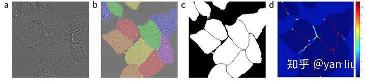

# 图像分割调研

## 1. 概念

​		在计算机视觉中，图像分割是个非常重要且基础的研究方向。简单来说，图像分割（Image Segmentation）就是根据某些规则把图片中的像素分成不同的部分（加不同的标签）。

​		图像分割中的一些常见的术语有：**超像素**（Superpixels）、**语义分割**（Semantic Segmentation）、**实例分割**（Instance Segmentation）、**全景分割**（Panoptic Segmentation）。他们之间到底有什么区别呢？

### 1.1 超像素分割

​		第一次听说这个超像素很容易理解错误，以为是在普通的像素基础上继续像微观细分，如果这样理解就恰好理解反了，其实超像素是一系列像素的集合，这些像素具有类似的**颜色**、**纹理**等特征，**距离**也比较近。用超像素对一张图片进行分割的结果见下图，其中每个白色线条区域内的像素集合就是一个超像素。需要注意的是，超像素很可能把同一个物体的不同部分分成多个超像素。

- [超像素分割有什么用呢？](https://cloud.tencent.com/developer/article/1015654)

  ​	超像素可以用来做跟踪、做标签分类、超像素级词袋、骨架提取、人体姿态估计、医学图像分割等。
  
  

### 1.2 语义分割

​		语义分割还是比较常见的，就是把图像中每个像素赋予一个类别标签（比如汽车、建筑、地面、天空等），比如下图就把图像分为了草地（浅绿）、人（红色）、树木（深绿）、天空（蓝色）等标签，用不同的颜色来表示。

​		不过这种分割方式存在一些问题，比如如果一个像素被标记为红色，那就代表这个像素所在的位置是一个人，但是如果有两个都是红色的像素，这种方式无法判断它们是属于同一个人还是不同的人。也就是说语义分割只能判断类别，无法区分个体。		

### 1.3 实例分割

​		实例分割方式有点类似于物体检测，不过物体检测一般输出的是 bounding box，实例分割输出的是一个mask。

​		实例分割和上面的语义分割也不同，它不需要对每个像素进行标记，它只需要找到感兴趣物体的边缘轮廓就行，比如下图中的人就是感兴趣的物体。该图的分割方法采用了一种称为Mask R-CNN的方法。我们可以看到每个人都是不同的颜色的轮廓，因此我们可以区分出单个个体。

### 1.4 全场景分割

​		最后说说全景分割，它是语义分割和实例分割的结合。如下图所示，每个像素都被分为一类，如果一种类别里有多个实例，会用不同的颜色进行区分，我们可以知道哪个像素属于哪个类中的哪个实例。比如下图中黄色和红色都属于人这一个类别里，但是分别属于不同的实例（人），因此我们可以通过mask的颜色很容易分辨出不同的实例。

### 1.5 物体识别

​		目前深度学习中关于物体识别的问题总共有四大类，从最简单的**图像分类** 到**物体定位** ，再到**语义分割** ，最后到难度最高的**实例分割**。

### 参考

- [超像素、语义分割、实例分割、全景分割 傻傻分不清？](https://zhuanlan.zhihu.com/p/50996404)

- [SLIC 超像素分割详解（三）：应用](https://cloud.tencent.com/developer/article/1015654)

  

## 2.语义分割

### 数据集

- **PASCAL VOC2012**

  ​		PASCAL视觉对象类数据集（PASCAL Visual Object Classes，简称VOC）是视觉对象类别识别和检测的评测指标，为视觉和机器学习社区提供了标准的图像数据集、标注数据集，以及标准的评估程序。这一挑战赛的主要目标是在现实场景中从大量的可视对象类中识别对象（即未预分割的对象）。

  

  - VOC 2012包含4个大类和20个小类：

    - 人类：人

    - 动物：鸟、猫、牛、狗、马、羊

    - 交通工具：飞机、自行车、船、公共汽车、汽车、摩托车、火车

    - 室内：瓶子、椅子、餐桌、盆栽、沙发、电视/显示器

      

- **Microsoft COCO**

  ​		COCO数据集支持目标检测、实例分割、全景分割、Stuff Segmentation、关键点检测、看图说话等任务类型。图片格式均为JPG格式，其中目标检测，实例分割任务对应的图像类别为80类；Stuff Segmentation，全景分割任务新增图像类别53类。

  

  

- **ADE20k**

  ​		ADE20K数据集由 MIT CSAIL 研究组于 2017 年发布，涵盖广泛的场景和对象类别，可用于场景感知、解析、分割、多物体识别和语义理解。该数据集构建了一个场景解析基准，包含150个对象和素材类。在此基础上对多个分割基线模型进行了评估。

  

  

- **CityScapes**

  ​		CityScapes是由奔驰自动驾驶实验室、马克思·普朗克研究所（Max Planck Institute）、达姆施塔特工业大学（Technische Universität Darmstadt）联合发布的图像数据集，专注于对城市街景的语义理解。该数据集包含50个城市不同场景、不同背景、不同街景，以及30类涵盖地面、建筑、交通标志、自然、天空、人和车辆等的物体标注，共有5000张精细标注的图像和2万张粗略标注的图像。均采用PASCAL VOC标准得分评价算法性能。

  
  
  

### 2.1 损失函数

#### 2.1.1 CE Loss

​		用于图像语义分割任务的最常用损失函数是像素级别的交叉熵损失，这种损失会逐个检查每个像素，将对每个像素类别的预测结果（概率分布向量）与我们的独热编码标签向量进行比较。

​		多类别交叉熵损失函数为：

​				**CE Loss** = $-\sum_{c=1}^{C}y_{c}log(p_{c})$

​		其中，$C$表示类别数，$y_{c}$是一个`one hot`向量，元素只有0和1两种取值，如果该类别和样本的类别相同就取1，否则取0，而${P_{c}}$表示预测样本属于${c}$的概率。

​		当类别数$M$等于2时，该损失函数就是二元交叉熵损失函数：

​				**BCE Loss** = -$ylog(p)-(1-y)log(1-p))$

​		交叉熵Loss可以用在大多数语义分割场景中，但它有一个明显的缺点，那就是对于只用分割前景和背景的时候，当前景像素的数量远远小于背景像素的数量时，即${y=0}$的数量远大于${y=1}$的数量，损失函数中${y=0}$的成分就会占据主导，使得模型严重偏向背景，导致效果不好。

#### 2.1.2 WCE Loss

​		由于交叉熵损失会分别评估每个像素的类别预测，然后对所有像素的损失进行平均，因此我们实质上是在对图像中的每个像素进行平等地学习。如果多个类在图像中的分布不均衡，那么这可能导致训练过程由像素数量多的类所主导，即模型会主要学习数量多的类别样本的特征，并且学习出来的模型会更偏向将像素预测为该类别。

​		比如对于二分类，正负样本比例为1: 99，此时模型将所有样本都预测为负样本，那么准确率仍有99%这么高，但其实该模型没有任何使用价值。为了平衡这个差距，就对正样本和负样本的损失赋予不同的权重，带权重的二分类损失函数公式如下：

​		**WCE Loss** =  $-\frac{num\_neg}{num\_pos}ylog(p) - (1-y)log(p)$

​		要减少假阴性样本的数量，可以增大**pos_weight**；要减少假阳性样本的数量，可以减小**pos_weight**。

​		

#### 2.1.3 Focal Loss

​		上面针对不同类别的像素数量不均衡提出了改进方法，但有时还需要将像素分为难学习和容易学习这两种样本。

​		容易学习的样本模型可以很轻松地将其预测正确，模型只要将大量容易学习的样本分类正确，loss就可以减小很多，从而导致模型不怎么顾及难学习的样本，所以我们要想办法让模型更加关注难学习的样本。对于较难学习的样本，将BCE Loss修改为：

​		-$(1-p)^{\gamma}ylog(p)-p^{\gamma}(1-y)log(1-p)$

​		其中，$\gamma$通常设置为2。而将这个修改和对正负样本不均衡的修改合并在一起，就是大名鼎鼎的Focal Loss：

​		**Focal Loss** = $-\alpha(1-p)^{\gamma}ylog(p)-(1-\alpha)p^{\gamma}(1-y)log(1-p)$

#### 2.1.4 Dice Loss

​		语义分割任务中常用的还有一个基于 Dice 系数的损失函数，该系数实质上是两个样本之间重叠的度量。此度量范围为 0~1，其中 Dice 系数为1表示完全重叠。Dice 系数最初是用于二进制数据的，其计算公式如下：		

​		**Dice** = $\frac{2|A\cap B|}{|A|+|B|}$

​		其中，${|A\cap B|}$表示集合A和集合B之间的公共元素，$|A|$和$|B|$分别表示表集合A和集合B中的元素个数。

​		对于在预测的分割掩码上评估 Dice 系数，我们可以将${|A\cap B|}$近似为预测掩码和标签掩码之间的逐元素乘法，然后对结果矩阵求和。

​		计算 Dice 系数的分子中有一个2，那是因为分母中对两个集合的元素个数求和，两个集合的共同元素被加了两次。 为了设计一个可以最小化的损失函数，可以简单地使用 ![[公式]](https://www.zhihu.com/equation?tex=1-Dice+)。 这种损失函数被称为 soft Dice loss，这是因为我们直接使用预测出的概率，而不是使用阈值将其转换成一个二进制掩码。Dice loss是针对前景比例太小的问题提出的，Dice系数源于二分类，本质上是衡量两个样本的重叠部分。对于神经网络的输出，分子与我们的预测和标签之间的共同激活有关，而分母分别与每个掩码中的激活数量有关，这具有根据标签掩码的尺寸对损失进行归一化的效果		

​		对于每个类别的mask，都计算一个 Dice 损失：

​		**Dice Loss** = $1-\frac{2\sum_{pixel}y_{true}y_{pred}}{\sum_{pixel}(y_{true}^{2}+y_{pred}^{2})}$ 或$1-\frac{2\sum_{pixel}y_{true}y_{pred}}{\sum_{pixel}(y_{true}+y_{pred})}$

​		将每个类的 Dice 损失求和取平均，得到最后的 Dice Soft Loss。Dice Loss使用于**样本极度不均衡**的情况，如果一般情况下使用Dice Loss会回反向传播有不利的影响，使得**训练不稳定**。假设我们用$p$来表示预测值，而$t$来表示真实标签值，那么交叉熵损失关于$p$的梯度形式类似于$p-t$，而Dice Loss的值是$1-\frac{2pt}{p^{2}+t^{2}}$ 或$1-\frac{2pt}{p+t}$，其关于$p$的梯度形式为或$\frac{2t^{2}}{(p+t)^{2}}$或$\frac{2t(t^{2}-p^{2}}{(p^{2}+t^{2})^2}$，可以看到在极端情况下即$p$和$t$都很小的时候，计算得到的梯度值可能会非常大，即会导致训练十分不稳定。

- **Dice loss为何能够解决正负样本不平衡问题?**

​		因为Dice Loss是一个区域相关的Loss。区域相关的意思就是，当前像素的loss不光和当前像素的预测值相关，和其他点的值也相关。Dice Loss的求交的形式可以理解为mask掩码操作，因此不管图片有多大，固定大小的正样本的区域计算的loss是一样的，对网络起到的监督贡献不会随着图片的大小而变化。从上图可视化也发现，训练更倾向于挖掘前景区域，正负样本不平衡的情况就是前景占比较小。而CE Loss 会公平处理正负样本，当出现正样本占比较小时，就会被更多的负样本淹没。

​		

#### 2.1.5 IOU Loss

​		前面我们知道计算 Dice 系数的公式，其实也可以表示为：

​		**Dice** = $\frac{2TP}{2TP+FN+FP}$

​		其中，$TP$、$FN$、$FP$分别表示真阳性，假阳性，假阴性的像素个数。IoU的计算公式和这个很像，区别就是 TP 只计算一次：

​		**IoU** = $\frac{|A\cap B|}{|A|+|B|-|A\cap B|}=\frac{TP}{TP+FP+FN}$

​		和Dice Soft Loss一样，通过IOU计算损失也是使用预测的概率值：

​		**IoU Loss** = $1-\frac{2\sum_{pixel}y_{true}y_{pred}}{\sum_{pixel}(y_{true}+y_{pred}-y_{true}y_{pred})}$

​		IoU Loss 和 Dice Loss 一样存在训练过程中不稳定的问题。

#### 2.1.6 Tversky Loss

​		实际上Dice Loss只是Tversky loss的一种特殊形式而已。Tversky 系数的定义，它是 Dice系数和 Jaccard系数（就是IoU系数）的广义系数, 公式为：

​		$T(A,B) = \frac{A\cap B}{A\cap B + \alpha|A-B| + \beta|B-A|}$

​		其中，A和B分别表示预测值和真值，当$\alpha$=$\beta$=0.5时，即为Dice系数，当$\alpha$=$\beta$=1.0时，即为Jaccard系数。|A-B|表示FP假阳性，|B-A|表示FN假阴性，通过调整$\alpha$和$\beta$参数来控制两者之间的平衡, 进而影响召回率等指标。

​		下表展示了对FCN使用 Tversky Loss 进行病灶分割，在不同参数下获得的结果。其中，Sensitivity代表召回率Recall，Specificity表示准确率Precision：

​		在极小的病灶下的分割效果图如下：

​		而在较大的病灶下的分割效果图如下：

#### 2.1.7 BCE+ Dice Loss

​		即将BCE Loss和Dice Loss进行组合，在数据较为均衡的情况下有所改善，但是在数据极度不均衡的情况下交叉熵Loss会在迭代几个Epoch之后远远小于Dice Loss，这个组合Loss会退化为Dice Loss。

​		Dice Loss与交叉熵经常搭配使用，具有以下优点：

- 1）Dice Loss相当于从全局上进行考察，BCE是从微观上逐像素进行拉近，角度互补。

- 2）当出现前后景极不均衡情况时。如一个512×512的图片只有一个10×10的分割样例。BCE全蒙背景依旧可以觉得效果很好，此时BCE无法解决这种极度不均衡情况。Dice Loss却不受前景大小的影响。
- 3）当出现分割内容不均衡情况时。如一个512×512的图片有一个10×10和一个200×200的分割样例。Dice Loss此时会趋向于学习大的块，而忽略小样本。但BCE依旧会对小样本进行学习。

- 4）BCE对Dice可以起到引导作用。如一个512×512的图片只有一个10×10的分割样例。如果在初始化时，预测结果完全没有在10×10范围内，此时Dice为0。如果只有Dice Loss则无法学习到正确的梯度下降方向。加上BCE可以给网络一个学习的方向。

#### 2.1.8 Dice + Focal Loss

​		与BCE Loss和Dice Loss进行组合类似，可以将Dice和Focal Loss结合用于网络训练。

​		**Loss** = $L_{Dice} + \lambda L_{Focal}=C-\sum_{c=1}^{C}\frac{TP(c)}{TP(c)+\alpha FP(c)+\beta FN(c)}-\lambda \frac{1}{N}\sum_{c=1}^{C}\sum_{n=1}^{N}y_{true}(c)(1-p(c))^{2}log(p(c)) $

#### 参考

- [【损失函数合集】超详细的语义分割中的Loss大盘点](https://zhuanlan.zhihu.com/p/103426335)

- [语义分割中的 loss function 最全面汇总](https://zhuanlan.zhihu.com/p/101773544)

- [从loss处理图像分割中类别极度不均衡的状况---keras](https://blog.csdn.net/m0_37477175/article/details/83004746)

- [图像分割中的Dice Loss](https://blog.csdn.net/longshaonihaoa/article/details/111824916)

  

### 2.2 评价指标

​		下面公式中的$i$和$j$分别表示语义结果组成的混淆矩阵的**横坐标**和纵坐标。例如$i=1$，$p_{11}$表示true positives，即本属于1类且预测也为1类；$\sum_{j=0}^{k}p_{1j}$表示本属于1类，切预测为其他类的像素点数，这里包含了$p_{11}$，$\sum_{j=0}^{k}p_{j1}$表示本属于其他类却预测为1类的像素点数，这里同样包含了$p_{11}$。如果在分母处$p_{11}$计算了两次，则要减去一个$p_{11}$。

- **PA**（像素准确率）

  ​		像素准确率是所有分类正确的像素数占像素总数的比例。

  

- **MPA**（平均像素准确率）

  ​		平均像素准确率是分别计算每个类别分类正确的像素数占所有预测为该类别像素数的比例，即准确率，然后累加求平均。

  

- **mIoU**（平均交并比）

  ​		计算每一类的IoU然后求平均。mIoU计算公式如下：

  

  

  

- **FWIoU**（频率权重交并比）

  ​	可以理解为根据每一类出现的频率对各个类的IoU进行加权求和。

  

#### 参考

- [语义分割之评价指标](https://zhuanlan.zhihu.com/p/61880018)

### 2.3 模型结构

#### 2.3.1 FCN

- 要点：

  - 不含全连接层(fc)的全卷积(fully conv)网络，可适应任意尺寸输入；
  - 增大数据尺寸的反卷积(deconv)层，能够输出精细的结果；
  - 结合不同深度层结果的跳级(skip)结构，同时确保鲁棒性和精确性。

- 不同stride下的分割结果：

  

- 论文：[Fully Convolutional Networks for Semantic Segmentation](https://arxiv.org/abs/1411.4038)
- 代码：https://github.com/shelhamer/fcn.berkeleyvision.org
- 博客：[[FCN的学习及理解]](https://blog.csdn.net/qq_36269513/article/details/80420363)

#### 2.3.2 U-Net

- 网络结构：

  ​		相比于FCN和Deeplab等，UNet共进行了4次上采样，并在同一个stage使用了skip connection，而不是直接在高级语义特征上进行监督和loss反传，这样就保证了最后恢复出来的特征图融合了更多的low-level的feature，也使得不同scale的feature得到了的融合，从而可以进行多尺度预测和Deep Supervision。4次上采样也使得分割图恢复边缘等信息更加精细。

- 输入预处理：

  ​		为了能更好的处理图像的边界像素，U-Net使用了镜像操作（Overlay-tile Strategy）来解决该问题。镜像操作即是给输入图像加入一个对称的边，如上图所示。那么边的宽度是多少呢？一个比较好的策略是通过感受野确定。因为有效卷积是会降低Feature Map分辨率的，但是我们希望 $512\times512$ 图像的边界点能够保留到最后一层Feature Map。所以我们需要通过加边的操作增加图像的分辨率，增加的尺寸即是感受野的大小，也就是说每条边界增加感受野的一半作为镜像边。根据图1中所示的压缩路径的网络架构，我们可以计算其感受野：

​		$Receptive  field = (((0\times 2 + 2+ 2)\times2+2+2)\times2+2+2)\times2+2+2=60$

​			  由于训练集只有30张训练样本，作者指出**任意弹性形变**的数据增强方式对训练非常有帮助。

- 损失函数：

​		ISBI数据集的一个非常严峻的挑战是紧密相邻的物体之间的分割问题。如图3所示，(a)是输入数据，(b)是Ground Truth，(c)是基于Ground Truth生成的分割掩码，(d)是U-Net使用的用于分离边界的损失权值。

- 要点：

  - 输入图像进行镜像操作，能够更好的处理边界像素，对数据进行任意的弹性形变增强，在少量训练数据样本中能够获得较好的分割结果；

  - 对称的编解码结构和skip连接，融合不同尺度的语义特征，使分割图恢复得到的边缘信息更加精细。

    

> 输入图像镜像操作预处理，编码和解码结构对称，concat操作复用低层特征，损失函数增加边界像素权重。

- 论文：[U-Net: Convolutional Networks for Biomedical Image Segmentation](https://arxiv.org/abs/1505.04597)

- 代码：https://github.com/milesial/Pytorch-UNet

- 博客：[[图像分割之U-Net]](https://zhuanlan.zhihu.com/p/43927696)

  

#### 2.3.4 U-Net++

- U-Net++演变过程：		

- 损失函数：

  每一个分支的损失函数（CE Loss + Dice Loss）：

  

  其中，$C$表示类别数，$N$表示每个batch中的像素数，$y_{n,c}$为GT，$p_{n,c}$为分割预测的概率值。

  总的损失函数：

  

  其中，$\eta$表示各分支的权重参数，文中作者取1。

- 剪枝：

  深度监督可对模型进行剪枝，UNet++可以以两种操作模式进行部署：

  - 集成模式，其中收集所有分割分支的分割结果，然后取其平均值；

  - 剪枝模式，其中仅从以下一种中选择分割输出：分割分支，其选择决定了模型修剪的程度和速度增益。

- 论文：[UNet++: Redesigning Skip Connections to Exploit Multiscale Features in Image Segmentation](https://arxiv.org/abs/1912.05074)

- 代码：https://github.com/MrGiovanni/UNetPlusPlus

- 博客：[研习U-Net](https://zhuanlan.zhihu.com/p/44958351)、[[论文笔记] UNet++](https://zhuanlan.zhihu.com/p/295427213)、[Biomedical Image Segmentation: UNet++](https://towardsdatascience.com/biomedical-image-segmentation-unet-991d075a3a4b)

  

#### 2.3.3 SegNet

> 采用SAME卷积，即先填充再卷积，卷积后图像尺度不变；池化层操作时记录最大值的index，upsampling的时候最大值放回index位置，其余位置为0；模型的输出尺度与输入尺度保持一致。

- 论文：[SegNet: A Deep Convolutional Encoder-Decoder Architecture for Image Segmentation](https://arxiv.org/abs/1511.00561)
- 代码：https://github.com/yassouali/pytorch-segmentation
- 博客：[[SegNet理解]](https://blog.csdn.net/zhuzemin45/article/details/79709874)

#### 2.3.4 DeepLab v3+

- 论文：[Encoder-Decoder with Atrous Separable Convolution for Semantic Image Segmentation](https://github.com/tensorflow/models/tree/master/research/deeplab)

- 代码：https://github.com/tensorflow/models/tree/master/research/deeplab

- 博客：[[语义分割]：DeepLab 系列详解笔记](https://blog.csdn.net/shinef/article/details/100042910)

  

## 3. 实例分割

### 3.1 损失函数

### 3.2 评价指标

### 3.3 模型结构 

#### 3.3.1 Mask RCNN

#### 3.3.2  FCIS

#### 3.3.3 YOLCAT

#### 3.3.4 PolarMask

#### 3.3.5 SOLO

#### 3.3.6 RDSNet & PointRend

#### 3.3.7 BlendMask

 

## 4. 全景分割

### Open-world image segmentation

